# Declarative Template Bindings

This document explains how FAST Element interprets declarative bindings,
compiles binding targets, tracks reactive dependencies, and routes DOM writes
through configured ponyfills.

## Pipeline

1. Authors provide an `<f-template name="...">` with declarative binding syntax.
2. `declarativeTemplate({ ponyfills })` composes the required runtime
   capabilities and waits for the matching publisher.
3. `TemplateParser` converts markup expressions into an interpreted
   strings/values representation and records schema paths.
4. `compileDeclarativeTemplate()` creates a `ViewTemplate` with
   `PartBindingDirective` factories.
5. `Compiler` parses the marker-bearing HTML and associates each factory with a
   structural target ID.
6. `HTMLView.bind()` evaluates each binding and commits its value through a DOM
   part.

```mermaid
flowchart LR
    MARKUP["Authored <f-template>"] --> PARSER["TemplateParser"]
    PARSER --> COMPILER["Declarative compiler"]
    COMPILER --> TEMPLATE["ViewTemplate"]
    TEMPLATE --> VIEW["HTMLView"]
    VIEW --> BINDING["PartBindingDirective"]
    BINDING --> SIGNALS["Signals adapter"]
    SIGNALS --> SCHEDULER["DOM scheduler"]
    SCHEDULER --> PART["Configured DOM part"]
    PART --> DOM["DOM commit"]
```



## Explicit capabilities

`declarativeTemplate()` has no unconfigured overload. A full FAST declarative
runtime can be composed as follows:

```ts
import { declarativeTemplate } from "@microsoft/fast-element/declarative.js";
import { declarativeParts } from "@microsoft/fast-element/ponyfills/declarative-parts.js";
import { domScheduler } from "@microsoft/fast-element/ponyfills/dom-scheduler.js";
import { signals } from "@microsoft/fast-element/ponyfills/signals.js";

const template = declarativeTemplate({
    ponyfills: [declarativeParts(), signals(), domScheduler()],
});
```

Ponyfill groups are recursively flattened. Duplicate capability kinds throw
during composition. Missing Signals or scheduler capabilities throw
immediately; missing part types throw only when markup uses the corresponding
DOM aspect.

## DOM aspects

| Declarative syntax | Capability |
|---|---|
| `attribute="{{value}}"` | `attribute-part` |
| `?disabled="{{value}}"` | `attribute-part` in boolean mode |
| `:value="{{value}}"` | `property-part` |
| `:classList="{{value}}"` | `token-list-part` |
| `@click="{{handler}}"` | `event-part` |
| Content and structural templates | `node-part`, `child-node-part`, or `view-part` |

Attribute compilation preserves the qualified name and namespace URI. Standard
`xlink`, `xml`, and `xmlns` prefixes are retained even when an intermediate HTML
parser does not preserve namespace metadata.

## Part lifecycle

Parts stage writes through `part.value` and apply them through `part.commit()`.
`PartGroup` commits multiple parts in order. `ChildNodePart` owns only the DOM
range between its boundary nodes, while the FAST-specific `ViewPart` adds
nested template composition, binding lifecycle, and hydration reconciliation.

The proposal-family aggregate `domParts()` includes only `Part`, `PartGroup`,
`NodePart`, `AttributePart`, and `ChildNodePart`. FAST-specific property, event,
token-list, and view behavior is available independently and through
`declarativeParts()`.

## Reactive updates

The Signals adapter observes FAST expressions and enqueues their DOM effects
through the configured scheduler. Writable state, computed values, and effects
also have independent export paths.

Computed signals are lazy. Each reevaluation unsubscribes stale dependencies,
and a failed computation remains dirty so a later read retries it. Effects are
owned by a DOM target, deduplicated by the scheduler, and unsubscribe all
dependencies on disposal or failed construction.

The DOM scheduler orders ancestor targets before descendants, supports
cancellation and reentrant work, and drains the rest of a batch before
surfacing a callback error. Its default queue integrates with FAST `Updates`;
platform scheduling can be enabled explicitly for experimentation.

## Hydration

Hydration remains opt-in through `enableHydration()`. The declarative compiler
retains target and view boundary markers so configured parts can bind to
existing DOM. `ViewPart` owns structural reconciliation for nested templates;
proposal-family parts remain independent of FAST hydration behavior.

See [Declarative Design](./declarative/design.md) for parser, bridge, lifecycle,
and fixture details.
